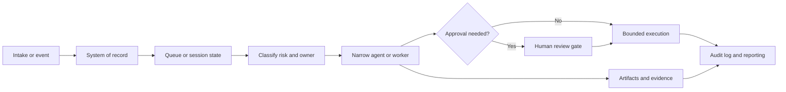

# Operator Governance Pattern - Sanitized Architecture

This is the generalized pattern that shows up across my current AI and operations work: compliance scanning, operational SaaS, risk-gated agent runtimes, document automation, and internal operator systems.

It is intentionally generic. It does not include private source code, credentials, hostnames, IPs, customer data, prompts, logs, or active infrastructure identifiers.

The diagram is deliberately boring. That is the point. Production AI needs a control layer around it.

## Flow

## Boundary Rules

- The database or task ledger is the source of truth, not the prompt.
- Agents receive narrow work, structured inputs, and expected outputs.
- Risk classification happens before material action.
- Medium/high-risk work routes through a review gate.
- External side effects must be bounded, logged, and reversible where possible.
- Evidence is captured as an output, not reconstructed later.
- Operators need status, errors, and escalation paths they can understand without reading raw logs.

## Where I Have Used This Pattern

- compliance scanning and evidence reporting;
- field-service/customer operations workflows;
- document automation and review workflows;
- risk-gated trading-agent research and paper-mode execution;
- internal support/sales operator lanes;
- local and remote agent monitoring.

## What This Proves

The model is only one part of the system. Production AI needs ownership, state, evidence, gates, observability, and a clean way for humans to intervene.
