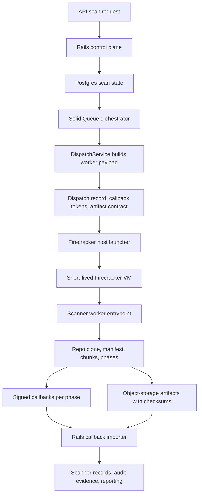

# EUCompli Scanner Worker Flow - Sanitized Architecture

This is a public, sanitized version of the agent workflow architecture behind my current EUCompli.ai / Paput.ai work.

It is based on the actual `compliv3` scanner-worker pattern, but intentionally omits private source code, customer data, secrets, host identifiers, raw payloads, repository contents, prompts, and infrastructure-specific values.

## Runtime Flow

## What Happens In The Flow

1. Rails receives a scan request and stores the scan as the system of record.
2. `ScanOrchestratorJob` claims the scan through Solid Queue.
3. `DispatchService` builds a worker payload with the scan id, phases, repository target, callback URLs/tokens, and artifact contract.
4. A safe dispatch record is persisted before live provider execution so callbacks can be reconciled even if they arrive quickly.
5. The live provider sends the payload to a trusted Firecracker host launcher over SSH.
6. The host starts one disposable Firecracker VM for the scanner job.
7. The VM receives the payload through Firecracker MMDS and runs the scanner worker entrypoint.
8. The worker clones the target repository read-only at the requested ref/SHA, builds a manifest, plans chunks, and runs scanner phases.
9. Large outputs are written as artifacts with checksum metadata rather than pushed directly through callback bodies.
10. The worker sends signed, idempotent callbacks for dispatch acknowledgement, manifest, and each scan phase.
11. Rails validates callback phase, scan id, dispatch id, provider job id, idempotency key, and token claims before importing results.
12. Rails imports artifact references, verifies checksums, persists scanner records, updates audit evidence, and reconciles completion.

## Phase Shape

Quick scan phases:

- classification
- GDPR analysis
- AI Act analysis when feature-gated
- regional compliance
- third-party audit
- audit report

Full scan adds:

- implementation planning
- code generation
- test generation
- documentation
- validation
- deployment when feature-gated
- monitoring
- learning

## Boundary Rules

- Rails and Postgres remain the source of truth.
- The model is not the system of record.
- The Firecracker VM is short-lived and disposable.
- Rails does not SSH into the VM.
- Repository cloning happens inside the worker runtime, not in Rails and not on the host launcher.
- Live provider callbacks must not reference unsafe local artifacts.
- Artifact references include byte counts and checksum metadata.
- Callback tokens are phase-specific and must match scan id, dispatch id, and phase.
- Idempotency keys prevent duplicate callback processing.

## What This Proves

The interesting part is not "an AI agent ran." The interesting part is the operating system around the agent work:

- durable scan state;
- queue-backed orchestration;
- explicit provider boundary;
- isolated compute for untrusted/heavier repository analysis;
- signed callbacks;
- checksum-backed artifacts;
- persisted evidence;
- completion reconciliation;
- customer/operator reporting.

That is the architecture needed when AI workflows have to be reviewable, auditable, and deployable instead of just impressive in a demo.
