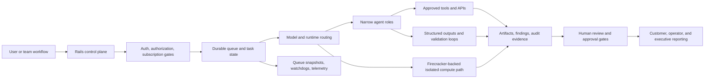

# Production Agent Workflow - Sanitized Architecture

This is the public, sanitized version of the operating pattern behind my current AI workflow work. It intentionally omits private product code, infrastructure identifiers, customer data, prompts, and internal service names.

## Design Notes

- The database and queue hold workflow state. The model is not the source of truth.
- Agents are intentionally narrow so outputs can be validated and handoffs can be debugged.
- Evidence is treated as a first-class output, not an afterthought.
- Human approval gates are used where automation can create customer, compliance, or operational risk.
- Isolated compute is the path for heavier scan workloads, higher concurrency, and safer execution boundaries.

## What This Diagram Shows

The important work is the operating layer around the model: state, gates, contracts, evidence, observability, and reporting.
